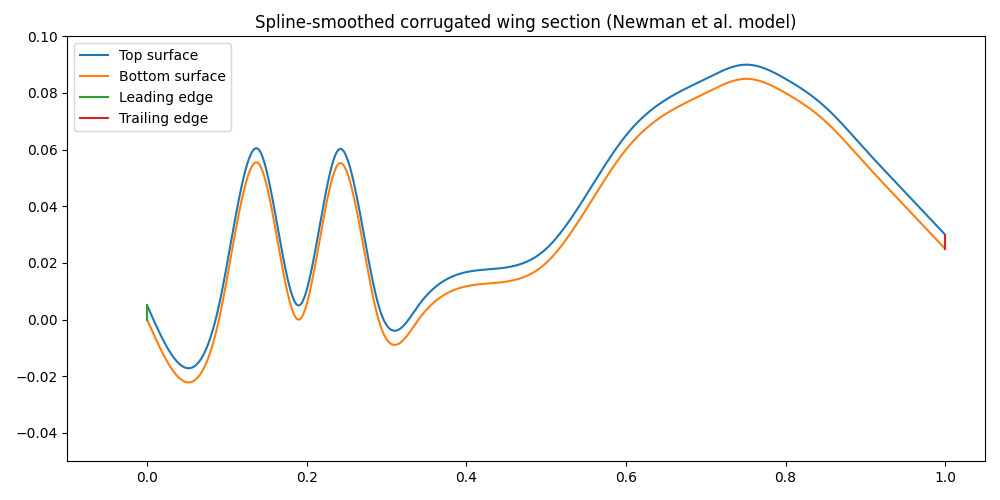

# corrugated wing optimization

## Quick Start

### 仮想環境構築(uv環境)

```bash
pip instal uv
uv venv
source .venv/bin/activate
uv sync
```

### コルゲート翼形状作成(16x2=32変数)

- x_b, y_b(32変数)を基に、1000次元に拡張してスプライン補完
- 厚み: 定数t
- 参考文献：https://www.cambridge.org/core/services/aop-cambridge-core/content/view/8A2761FBC15473F2CC76ADA9F9366AA9/S0022112025002058a.pdf/wake_transition_and_aerodynamics_of_a_dragonflyinspired_airfoil.pdf

```bash
uv run shape.py
```

実行結果：



### 深層強化学習モデル

## ファイル構成

### env.py
コルゲート翼最適化のためのGym環境クラス
- **WingOptimizationEnv**: 強化学習環境（16個の制御点パラメータを調整）
- **build_airfoil_shape()**: パラメータから翼形状（上面・下面）を生成
- **compute_lift_drag()**: 擬似CL/CD評価関数（ダミーで平らな翼ほど報酬大にしている、ここをFreeFEM++呼び出しに変更）

### train.py
TD3深層強化学習によるモデル訓練
- TD3エージェントによる5000ステップの訓練
- アクションノイズによる探索制御
- 訓練済みモデルを`models/td3_corrugated`に保存

```bash
uv run train.py
```

### test.py
訓練済みモデルの推論と結果可視化
- 100エピソードの推論実行
- 最良結果を`results/best_shape.json`に保存
- 最適化された翼形状の可視化プロット表示

```bash
uv run test.py
```